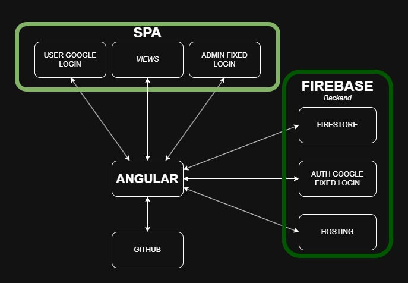

# Documentacion Cortes Energia
## El problema y a quién afecta
Los cortes de luz no se comunican bien, la gente no sabe cuándo va a haber uno programado en su zona, ni puede reportar uno en curso. Afecta a cualquier vecino de la ciudad, especialmente en zonas con hospitales u otros servicios críticos.
## Alcance
- Vista pública de cortes.
- Reporte de cortes con cuenta de Google.
- Revisión de reportes por un admin (descartar/programar/urgente + mensaje al usuario). 
- Panel para crear cortes programados (admin). 
- Dashboard simple de "mis reportes" (usuario). 

NO INCLUYE: 

- Mapa. 
- Notificaciones push.
- Métricas/gráficos. 
- Agrupación automática de reportes.
- Edición de reportes por el usuario.

## Diagrama


## Justificacion de tecnlogías

Con fines de aprendizaje se utilizaron las siguientes tecnologías:

- Angular SPA sin SSR en vez de Next.js/SSR: los datos son en tiempo real y no hace falta SEO.
- Firestore en vez de una base SQL propia: modelo simple, sin relaciones complejas, y da lectura pública en tiempo real gratis.
- Firebase Auth en vez de login propio: no vale la pena reinventar autenticación para este alcance.
- Reglas de seguridad de Firestore en vez de backend propio (NestJS/Express): la lógica de permisos es simple y no justifica mantener un servidor.
- Plan Spark (gratis) en vez de Blaze: no se usa Storage ni nada que exceda la cuota gratuita.

Herramientas utilizadas:

- Debian en WSL2.
- VS Code.
- Asistencia de IA.
- Git y Github.
- Firebase CLI.

## Información Técnica
Este proyecto fue generado con [Angular CLI](https://github.com/angular/angular-cli) version 21.2.20.

## Requisitos

Vea las instrucciones de instalacion de cada tecnologia en su respectiva documentacion en internet.

- Node instalado, version 24 recomendado.
- Node Package Manager (npm) instalado.
- Git instalado.
- Angular instalado (opcional).

## Instrucciones
Clonar el repositorio

```bash
git clone https://github.com/erick5991/cortes-energia.git
```
Ingresar al directorio
```bash 
cd cortes-energia
```
Instalar dependencias
```bash
npm install
```
## Ambiente de desarrollo

Para iniciar el servidor de desarrollo ejecute:

```bash
ng serve
```
Si no tiene Angular instalado, ejecute:

```bash
npm start
```

Una vez que el servidor esté en ejecución, abre tu navegador y ve a `http://localhost:4200/`. La aplicación se recargará automáticamente cada vez que modifiques cualquiera de los archivos fuente.

## Compilar el proyecto

Para compilar el proyecto, ejecuta:

```bash
ng build
```

Si no tiene Angular instalado, ejecute:

```bash
npm run build
```

Esto compilará la aplicación y almacenará los archivos generados en el directorio `dist/`. De forma predeterminada, la compilación para producción optimiza la aplicación para obtener el mejor rendimiento y velocidad.

## Ejecutar pruebas unitarias

TODO

## Ejecutar pruebas de extremo a extremo (E2E)

TODO

## Recursos adicionales

Para obtener más información sobre el uso de Angular CLI, incluidos los comandos disponibles y su referencia detallada, consulta la documentación oficial de [Angular CLI Overview and Command Reference](https://angular.dev/tools/cli).